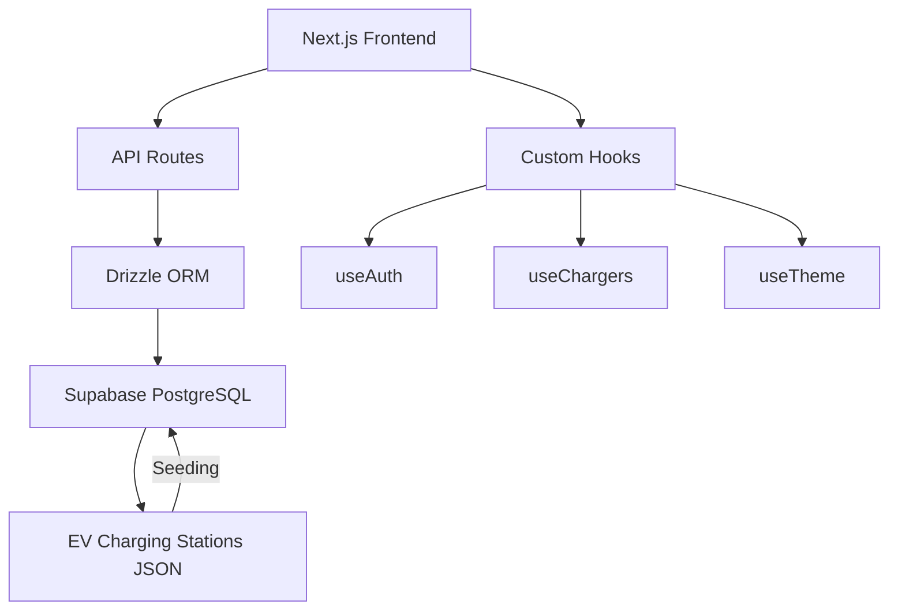
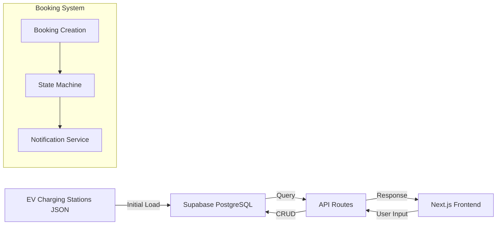

# Project Audit Report

## 1. System Architecture


## 2. Data Flow


## 3. Database Schema
```mermaid
entity ChargingStation {
    * id = uuid
    name = text
    location = jsonb
    status = text
    created_at = timestamp
}

entity Booking {
    * id = uuid
    station_id = uuid
    user_id = uuid
    start_time = timestamp
    end_time = timestamp
    status = text
}

ChargingStation --|1..*| Booking : has

entity User {
    * id = uuid
    email = text
    created_at = timestamp
}

User --|1..*| Booking : made
```

## 4. Checkpointing Strategy
- Seed script progress tracking via `checkpoint.md`
- State versioning in `Booking` table
- Weekly database snapshots
- CI/CD pipeline state preservation

Read [](file:///d%3A/Dtu%20and%20doc/THE%20RISING%20PROJECT/implement%20this/electric-upi/app/api)

Read [](file:///d%3A/Dtu%20and%20doc/THE%20RISING%20PROJECT/implement%20this/electric-upi/drizzle.config.ts)

Read [](file:///d%3A/Dtu%20and%20doc/THE%20RISING%20PROJECT/implement%20this/electric-upi/app/api/bookings)

Read [](file:///d%3A/Dtu%20and%20doc/THE%20RISING%20PROJECT/implement%20this/electric-upi/app/api/chargers)

Read [](file:///d%3A/Dtu%20and%20doc/THE%20RISING%20PROJECT/implement%20this/electric-upi/lib/db.ts)

Read [](file:///d%3A/Dtu%20and%20doc/THE%20RISING%20PROJECT/implement%20this/electric-upi/app/api/bookings/route.ts#1-1), lines 1 to 60

Read [](file:///d%3A/Dtu%20and%20doc/THE%20RISING%20PROJECT/implement%20this/electric-upi/app/api/charging-sites/route.ts#1-1), lines 1 to 60

Read [](file:///d%3A/Dtu%20and%20doc/THE%20RISING%20PROJECT/implement%20this/electric-upi/app/api/chargers/route.ts#1-1), lines 1 to 60

Searched for text `DATABASE_URL|DBTransactionPoolerURL|createPool|new Pool|postgres://|postgresql://` (`**/app/api/**/*.ts`), no results

Searched for text `DATABASE_URL|DBTransactionPoolerURL|createPool|new Pool|postgres://|postgresql://| drizzle\(|postgres\(` (`**/app/api/**/*.ts`), no results

Searching for text `DBTransactionPoolerURL|DATABASE_URL|new Pool|drizzle\(|postgres\(`

Searched for text `DBTransactionPoolerURL|DATABASE_URL` (`**/lib/db.ts`), 3 results

Searched for text ` drizzle\(|new Pool\(|postgres\(|Client|DATABASE_URL|DBTransactionPoolerURL` (`**/app/api/**/*.ts`), 51 results

## Current DB Connection Setup

Ye project **already sahi se configured** hai:

### db.ts (API routes ke liye)
```ts
const connectionString = process.env.DBTransactionPoolerURL || process.env.DATABASE_URL;
```
- **Primary**: `DBTransactionPoolerURL` (Supabase Transaction Pooler)
- **Fallback**: `DATABASE_URL` (direct connection)

### drizzle.config.ts (migrations ke liye)
```ts
dbCredentials: { url: process.env.DATABASE_URL! }
```
- Direct connection use karta hai for schema pushes/migrations

---

## Ky ye best hai

| Use Case | Current Config | Why |
|----------|---------------|-----|
| **API routes** (Next.js serverless) | `DBTransactionPoolerURL` | Pooler short-lived connections ke liye optimized hai, connection reuse karta hai |
| **Migrations/seed scripts** | `DATABASE_URL` | Long-running operations, bulk inserts ke liye direct connection better hai |
| **Drizzle ORM queries** | Via db.ts | Already pooler se hi ho rhi hai |

---

## Verdict

**Koi change nahi chahiye.** Current setup already optimal hai:

- API data fetching → `DBTransactionPoolerURL` se ho rhi hai ✅
- Migrations → `DATABASE_URL` se ho rhi hai ✅
- Seed scripts → `DATABASE_URL` use kar rhe hain ✅

Agar aap chahte ho ki **seed scripts bhi pooler use karein**, to `scratch/*.js` files mein `process.env.DATABASE_URL` ko `process.env.DBTransactionPoolerURL` ya `process.env.DBTransactionPoolerURL || process.env.DATABASE_URL` se replace kar sakte ho. But for bulk inserts, direct `DATABASE_URL` is actually faster since it avoids pooler overhead.