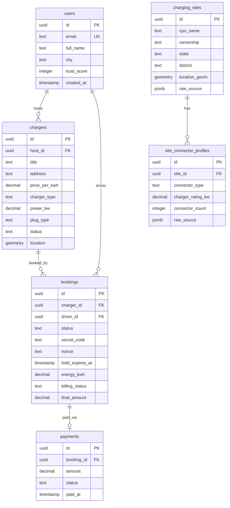

# Drizzle ORM ↔ Electric UPI — Complete Mapping Reference

> Auto-generated from codebase audit + Drizzle ORM docs.  
> Last updated: 2026-06-27

---

## 1. Schema → Tables Mapping

| Drizzle API | Electric UPI Table | File | Key Columns |
|---|---|---|---|
| `pgTable("users", {...})` | `users` | `lib/schema.ts:3` | id(uuid PK), email(unique), fullName, city, trustScore, createdAt |
| `pgTable("chargers", {...})` | `chargers` | `lib/schema.ts:12` | id(uuid PK), hostId(FK→users), title, address, city, pricePerKwh, chargerType, powerKw, plugType, status, latitude, longitude, **location(geometry)** |
| `pgTable("charging_sites", {...})` | `charging_sites` | `lib/schema.ts:38` | id(uuid PK), cpoName, ownership, state, district, cityVillage, location, latitude, longitude, **location_geom(geometry)**, rawSource(jsonb), **$onUpdateFn** |
| `pgTable("site_connector_profiles", {...})` | `site_connector_profiles` | `lib/schema.ts:56` | id(uuid PK), siteId(FK→charging_sites), connectorType, chargerRatingKw, connectorRatingKw, connectorCount, rawSource(jsonb) |
| `pgTable("bookings", {...})` | `bookings` | `lib/schema.ts:67` | id(uuid PK), chargerId(FK→chargers), driverId(FK→users), status, secretCode, nonce, holdExpiresAt, energyKwh, billingStatus, finalAmount |
| `pgTable("payments", {...})` | `payments` | `lib/schema.ts:93` | id(uuid PK), bookingId(FK→bookings), amount, status, providerRef, paidAt |

---

## 2. Column Types → Usage Matrix

| Drizzle Type | Used In | Columns | Notes |
|---|---|---|---|
| `uuid` | ALL tables | All PKs + FKs | `.default(sql\`gen_random_uuid()\`)` — NOT `.defaultRandom()` |
| `text` | ALL tables | titles, addresses, status enums, plug types | Most common type in project |
| `decimal(p,s)` | chargers, chargingSites, bookings, payments | pricePerKwh(6,2), powerKw(6,2), latitude(10,7), longitude(10,7), energyKwh(8,3), finalAmount(10,2), amount(10,2) | Returns **string** at runtime — must `parseFloat()` |
| `integer` | users, siteConnectorProfiles | trustScore, connectorCount | |
| `timestamp(tz)` | ALL tables | createdAt, startedAt, endedAt, codeExpiresAt, etc. | `.defaultNow()` for auto-set |
| `boolean` | bookings | codeUsed, nonceUsed, hostConfirmed, driverConfirmed | `.default(false)` |
| `geometry("point", mode:"xy", srid:4326)` | chargers, chargingSites | location, location_geom | PostGIS — requires raw SQL for queries |
| `jsonb` | chargingSites, siteConnectorProfiles | rawSource | Stores full API response JSON |

---

## 3. Constraints → Usage

| Constraint | Drizzle API | Where Used |
|---|---|---|
| Primary Key | `.primaryKey()` | All 6 tables (uuid) |
| Default UUID | `.default(sql\`gen_random_uuid()\`)` | All PKs — project convention |
| Unique | `.unique()` | `users.email` only |
| Not Null | `.notNull()` | Most columns except optional ones (area, pincode, state, amenities, etc.) |
| Foreign Key | `.references(() => table.id, { onDelete: "cascade" })` | chargers→users, bookings→chargers, bookings→users, payments→bookings, siteConnectorProfiles→chargingSites, bookings.nonceGeneratedBy→users |
| Default Value | `.default(val)` | status fields ("pending", "draft"), trustScore(100), site_type("home"), booleans(false) |
| Auto-update timestamp | `.$onUpdateFn(() => new Date())` | `chargingSites.updatedAt` — ONLY place used |
| PostGIS SRID | `geometry("col", { type:"point", mode:"xy", srid:4326 })` | chargers.location, chargingSites.location_geom |

**NOT YET USED but available:**
- `uniqueIndex()` — could index on chargers(hostId+status)
- `index()` — could index on bookings(driverId), bookings(chargerId), bookings(status)
- `check()` — could enforce status enums
- Composite PK — not needed (all single uuid PK)

---

## 4. Relations → ER Diagram



### Relations Definitions (lib/schema.ts)

| Relation | Type | Definition |
|---|---|---|
| `usersRelations` | one→many | chargers, bookings |
| `chargersRelations` | one→users (host), many→bookings | `one(users)`, `many(bookings)` |
| `chargingSitesRelations` | one→many | connectorProfiles |
| `siteConnectorProfilesRelations` | many→one | `one(chargingSites)` |
| `bookingsRelations` | one→chargers, one→users (driver), many→payments | `one(chargers)`, `one(users)`, `many(payments)` |
| `paymentsRelations` | one→bookings | `one(bookings)` |

---

## 5. CRUD Operations → API Routes

### SELECT (Read)

| Pattern | Route | Drizzle Style |
|---|---|---|
| `db.select().from(table).where(eq(...)).limit(1)` | `/api/bookings` POST (check charger) | Builder — simple lookup |
| `db.select({field1, field2}).from(t).innerJoin(...)` | `/api/bookings/[id]` GET | Builder — partial select + join |
| `db.select().from(bookings).where(and(eq, inArray))` | `/api/bookings` POST (active check) | Builder — compound filter |
| `db.select().from(payments).where(and(eq,eq)).orderBy(desc).limit(1)` | `/api/bookings/[id]` GET | Builder — ordered lookup |
| `db.execute(sql\`SELECT ... ST_DWithin ...\`)` | `/api/chargers/search` GET | **Raw SQL** — PostGIS geo query |
| `db.execute(sql\`SELECT ... WHERE ${whereClause}\`)` | `/api/charging-sites` GET | **Raw SQL** — dynamic WHERE via `sql.join()` |

### INSERT (Create)

| Pattern | Route | Drizzle Style |
|---|---|---|
| `db.insert(bookings).values({...})` | `/api/bookings` POST | Builder — standard insert |
| `db.insert(users).values({...})` | `/api/bookings` POST (auto-create) | Builder — conditional insert |
| `db.insert(payments).values({...})` | `/api/bookings/[id]/pay` POST | Builder — standard insert |

### UPDATE (Modify)

| Pattern | Route | Drizzle Style |
|---|---|---|
| `db.update(bookings).set({status}).where(and(eq,eq))` | `/api/bookings/[id]/accept` | Builder — conditional update |
| `db.update(bookings).set({status,endedAt}).where(and(eq,eq,ne))` | `/api/bookings/[id]/accept` (cancel others) | Builder — multi-condition |
| `db.update(bookings).set({secretCode,codeExpiresAt,...})` | `/api/bookings/[id]/generate-code` | Builder — code generation |
| `db.update(bookings).set({status:"completed",energyKwh,...})` | `/api/bookings/[id]/end` | Builder — session end |
| `db.update(bookings).set({billingStatus:"finalized",...})` | `/api/bookings/[id]/billing/finalize` | Builder — billing finalize |
| `db.update(bookings).set({status:"cancelled"})` | `/api/bookings/[id]/cancel` | Builder — simple status change |

### DELETE

| Pattern | Route | Drizzle Style |
|---|---|---|
| **NOT USED** in any API route | — | — |

> ⚠️ No `db.delete()` calls exist in the codebase. Deletion is handled via status changes ("cancelled") or cascade on FK.

---

## 6. Operators → Usage Matrix

| Operator | Import | Used In Routes | Example |
|---|---|---|---|
| `eq` | `drizzle-orm` | ALL booking routes, bookings POST | `eq(bookings.id, id)` |
| `and` | `drizzle-orm` | accept, end, finalize, pay, bookings POST | `and(eq(bookings.id, id), eq(bookings.status, "charging"))` |
| `ne` | `drizzle-orm` | accept (cancel others) | `ne(bookings.id, id)` |
| `inArray` | `drizzle-orm` | bookings POST (active check) | `inArray(bookings.status, activeStatuses)` |
| `desc` | `drizzle-orm` | bookings/[id] GET (latest payment) | `desc(payments.createdAt)` |
| `or` | `drizzle-orm` | chargers/search (rare) | `or(ilike(...), ilike(...))` |
| `ilike` | `drizzle-orm` | chargers/search (raw SQL) | Used inside `sql` template |
| `lte` | `drizzle-orm` | chargers/search (raw SQL) | `c.price_per_kwh <= ${maxPrice}` |
| `lt` | `drizzle-orm` | Not used in builder (available) | — |
| `sql` | `drizzle-orm` | chargers/search, charging-sites | `sql\`ST_DWithin(...)\`` |
| `sql.join()` | `drizzle-orm` | charging-sites | Dynamic WHERE clause assembly |
| `aliasedTable` | `drizzle-orm` | bookings/[id] GET | `aliasedTable(users, "driver_users")` |

---

## 7. Join Patterns → Usage

| Join Type | Drizzle API | Route | Purpose |
|---|---|---|---|
| INNER JOIN | `.innerJoin(table, eq(...))` | bookings/[id] GET | booking+charger, booking+driver, booking+host |
| LEFT JOIN | `.leftJoin(table, eq(...))` | chargers/search (raw SQL) | charger+host user |
| Aliased Self-Join | `aliasedTable(users, "alias")` | bookings/[id] GET | Same table joined twice (driver + host) |

**NOT USED but available:**
- `rightJoin`, `fullJoin`, `crossJoin` — no current use case
- `leftJoinLateral`, `innerJoinLateral` — could optimize sub-selects

---

## 8. Raw SQL Patterns → PostGIS

### When to Use Raw SQL vs Builder

| Scenario | Recommended | Why |
|---|---|---|
| Simple CRUD by PK | **Builder** | Type-safe, auto-inferred |
| Multi-table join with partial select | **Builder** | Type-safe column selection |
| PostGIS geo queries (ST_DWithin, ST_Distance) | **Raw SQL** | No Drizzle support for PostGIS functions |
| Dynamic WHERE with variable fragments | **Raw SQL + sql.join()** | Builder can't handle variable # of conditions elegantly |
| Complex aggregation + geo | **Raw SQL** | Combines PostGIS + GROUP BY |

### Raw SQL Pattern: Geo Search (chargers/search)

```
db.execute(sql`
  SELECT c.*, u.full_name, 
    ST_Distance(location, point) / 1000 AS distance_km
  FROM chargers c LEFT JOIN users u ON c.host_id = u.id
  WHERE c.status = 'active'
  ${q ? sql`AND (c.title ILIKE ${pattern})` : sql``}
  ${hasGeo ? sql`AND ST_DWithin(...)` : sql``}
  ORDER BY location <-> point
  LIMIT ${n} OFFSET ${offset}
`)
```

### Raw SQL Pattern: Dynamic WHERE (charging-sites)

```
const fragments: ReturnType<typeof sql>[] = [];
if (q) fragments.push(sql`cs.cpo_name ILIKE ${pattern}`);
if (state) fragments.push(sql`cs.state ILIKE ${state}`);
const whereClause = sql.join(fragments, sql` AND `);
db.execute(sql`SELECT ... WHERE ${whereClause} LIMIT ...`);
```

### Raw SQL Pattern: IN clause with UUID array

```
const uuidList = sql.join(ids.map(id => sql`${id}::uuid`), sql`, `);
db.execute(sql`... WHERE site_id = ANY(ARRAY[${uuidList}]::uuid[])`);
```

---

## 9. Type Inference Patterns

| Pattern | Code | Returns |
|---|---|---|
| Select type | `typeof users.$inferSelect` | Full row type (all columns) |
| Insert type | `typeof users.$inferInsert` | Row with optional fields |
| Destructured select | `db.select({a: t.col}).from(t)` | `{a: type}[]` — only selected fields |
| Raw SQL result | `db.execute(sql\`...\`)` | `{rows: Record<string, unknown>[]}` — **UNTYPED** |
| decimal columns | Always `string` at runtime | Must `parseFloat()` manually |

---

## 10. Migration Workflow

| Command | Purpose | When |
|---|---|---|
| `npx drizzle-kit generate` | Generate SQL from schema diff | After schema.ts changes |
| `npx drizzle-kit migrate` | Apply pending migrations | Deploy / CI |
| `npx drizzle-kit push` | Push schema directly (no migration files) | Dev only — risky for prod |
| `npx drizzle-kit studio` | GUI to browse data | Debugging |

### Config (drizzle.config.ts)

```ts
schema: './lib/schema.ts'    // single source of truth
out: './drizzle'              // migration files folder
dialect: 'postgresql'
tablesFilter: ['!spatial_ref_sys', '!geography_columns', '!geometry_columns']
// ↑ Excludes PostGIS system tables from migration diff
```

---

## 11. Upsert / Conflict Patterns (from Drizzle Docs)

| Pattern | Drizzle API | Use Case in Project |
|---|---|---|
| Insert or ignore | `.onConflictDoNothing()` | Seed scripts — skip existing sites |
| Insert or update | `.onConflictDoUpdate({target, set})` | Seed scripts — update raw_source |
| Returning inserted | `.returning()` | Get auto-generated id back |
| Returning partial | `.returning({id: t.id})` | Only need PK |

**Current seed scripts** use raw SQL with `ON CONFLICT DO NOTHING` — could migrate to Drizzle builder for type safety.

---

## 12. Missing Patterns → Opportunities

| Pattern | Drizzle Feature | Current Gap | Benefit |
|---|---|---|---|
| **Transactions** | `db.transaction(async (tx) => {...})` | Booking creation does 3 separate queries (check charger, check active, insert) | Atomicity — prevents race conditions |
| **Returning on update** | `.returning()` | All updates do a separate SELECT to verify | 1 query instead of 2 |
| **$count** | `db.$count(table, filter)` | Manual `SELECT COUNT(*)` in search route | Simpler count queries |
| **CTE / WITH** | `db.$with('name').as(...)` | Complex queries in search route | Break down geo queries |
| **Indexes** | `index("name").on(t.col)` | No indexes defined in schema | Performance on bookings.status, chargers.hostId |
| **Unique Index** | `uniqueIndex("name").on(t.col)` | No unique constraints beyond email | Prevent duplicate bookings |
| **Check constraints** | `.check("name", sql\`...\`)` | Status enums not enforced at DB level | Data integrity |
| **Relational queries** | `db.query.bookings.findMany({with:{charger:true}})` | All joins are manual `.innerJoin()` | Less boilerplate for common joins |
| **Delete** | `db.delete(table).where(...)` | Not used — only status changes | Cleanup stale data |
| **Subqueries** | `db.select().from(t).as('alias')` | Not used | Could replace some raw SQL |
| **Conditional select** | `...(condition ? {field: t.col} : {})` | Not used | Dynamic column selection |
| **getColumns** | `getColumns(table)` (v1) | Not used | Select all + computed columns |

---

## 13. Quick Reference: Import Map

```ts
// Schema definition
import { pgTable, uuid, text, decimal, integer, timestamp, boolean, geometry, jsonb } from "drizzle-orm/pg-core";
import { relations, sql } from "drizzle-orm";

// Database connection
import { drizzle } from "drizzle-orm/node-postgres";

// Query operators
import { eq, and, or, ne, lt, lte, gt, gte, ilike, inArray, desc, asc, not } from "drizzle-orm";
import { sql, aliasedTable, alias } from "drizzle-orm";

// Aggregation helpers (available but unused)
import { count, countDistinct, sum, avg, max, min } from "drizzle-orm";

// Drizzle Kit
import type { Config } from 'drizzle-kit';
```

---

## 14. Decision Log

| Decision | Rationale |
|---|---|
| `gen_random_uuid()` over `.defaultRandom()` | Supabase/Postgres native — no JS dependency |
| Raw SQL for geo queries | Drizzle has no PostGIS operator support |
| `sql.join()` for dynamic WHERE | Cleaner than string concatenation, parameterized |
| `parseFloat()` for decimals | Drizzle decimal returns string — project convention |
| `aliasedTable` for self-joins | Needed when joining `users` twice (driver + host) |
| No `db.delete()` in API | Soft-delete via status field — safer for audit trail |
| `$onUpdateFn` only on chargingSites | Only table that needs auto-updated `updatedAt` |
| `tablesFilter` excludes PostGIS tables | Prevents migration from touching system views |

Updated memory file [](file:///c%3A/Users/Mani/AppData/Roaming/Code/User/workspaceStorage/11cfdebce9daf4486108ea1ae0e6c773/GitHub.copilot-chat/memory-tool/memories/YzNjNzZmNTItMzdkMi00OWUwLTkwY2UtMTQzMzVkNTRhNmVh/plan.md)

Plan complete. Here is the comprehensive Drizzle ORM mapping document:

## Plan: Drizzle ORM ↔ Electric UPI Mapping Doc

**TL;DR**: Comprehensive mapping reference created at `/memories/repo/drizzle-orm-mappings.md` — connects every Drizzle ORM concept (schema, CRUD, operators, joins, types, migrations) to concrete usage in Electric UPI's 6 tables and ~10 API routes.

**Document Structure (14 sections)**:

1. **Schema → Tables** — All 6 tables with key cols
2. **Column Types → Usage** — 8 types (uuid, text, decimal, integer, timestamp, boolean, geometry, jsonb)
3. **Constraints → Usage** — PK, unique, FK, default, `$onUpdateFn`, PostGIS SRID
4. **Relations → ER Diagram** — Mermaid diagram of 5 relationships
5. **CRUD → API Routes** — SELECT (6 patterns), INSERT (3), UPDATE (6), DELETE (0)
6. **Operators → Matrix** — eq/and/ne/inArray/desc/or/ilike/lte/sql/sql.join/aliasedTable
7. **Join Patterns** — innerJoin, leftJoin, aliased self-join
8. **Raw SQL → PostGIS** — 3 patterns (geo search, dynamic WHERE, IN array)
9. **Type Inference** — `$inferSelect`/`$inferInsert` patterns
10. **Migration Workflow** — generate/migrate/push/studio + config notes
11. **Upsert/Conflict** — `onConflictDoNothing/Update` for seed scripts
12. **Missing Patterns → Opportunities** — 12 gaps (transactions, `$count`, CTE, indexes, relational queries, etc.)
13. **Import Map** — Quick reference for all imports
14. **Decision Log** — 8 project-specific decisions

**Key Findings**:
- **NO `db.delete()`** in codebase — soft delete via status
- **NO `db.transaction()`** — booking flows use 3 separate queries (race condition risk)
- **NO `.returning()`** on updates — every update does a separate SELECT
- **NO indexes defined** in schema — performance concern at scale
- **NO check constraints** — status enums not enforced at DB level
- **Raw SQL required** for all PostGIS queries (no Drizzle support)

**Relevant files**:
- schema.ts — 6 tables, 6 relations
- db.ts — Connection setup
- drizzle.config.ts — Migration config
- route.ts — Raw SQL + PostGIS
- route.ts — Dynamic WHERE via `sql.join()`
- route.ts — Aliased self-join + partial select
- route.ts — Multi-condition update

**Verification**:
1. Open `/memories/repo/drizzle-orm-mappings.md` to confirm all 14 sections are present
2. Cross-check ER diagram matches schema.ts relations
3. Verify operator list matches grep results across api

Document is ready for use as a developer reference when adding new routes, debugging query patterns, or onboarding new contributors.