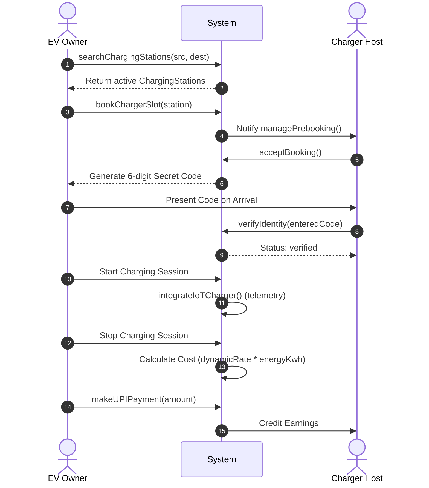

# 📐 UML Architecture & System Design Specifications

This document catalogs the system entities, methods, and relationships defined in our UML and Use-Case diagrams. It serves as the single source of truth for the codebase implementation, linking database schemas, APIs, and client-side components to their architectural designs.

---

## 👥 1. Actors & Classes

### 🚗 EV Owner / Driver (`EVOwner`)
Represents the user who discovers, books, and pays for charging services.
*   **Core Responsibilities:**
    *   `searchChargingStations(src, dest)`: Search for available chargers by location.
    *   `planRoute(src, dest)`: Find chargers along a travel path.
    *   `bookChargerSlot(station)`: Reserve a slot at a selected charging station.
    *   `makeUPIPayment(amount)`: Execute UPI payment to settle session bills.
    *   `verifyIdentity()`: Authenticate and complete user KYC.
    *   `viewDynamicPricing()`: View variable price rates of chargers.
    *   `referFriends()`: Share referral links to boost user acquisition.
    *   `viewLeaderboard()`: Check gamified driver/host rankings.

### 🏠 Charger Host (`Host`)
Represents the owner who registers, manages, and monetizes their home-based charging equipment.
*   **Core Responsibilities:**
    *   `listCharger(address, details)`: Publish a home charger to the network.
    *   `managePrebooking()`: Accept or decline driver slot requests.
    *   `viewEarningsDashboard()`: Track revenue and completed payouts.
    *   `setDynamicRates()`: Adjust pricing dynamically based on demand/time.
    *   `completeKYC()`: Verify identity and bank details for UPI settlements.

### 🔋 Charging Station (`ChargingStation`)
The physical or virtual node on the network representing the charger asset.
*   **Attributes:**
    *   `stationId`: Unique identifier (UUID).
    *   `location`: Address and coordinate coordinates.
    *   `availability`: Calendar schedule indicating operational hours.
    *   `dynamicRate`: Active price per kWh.

### 💻 Core System (`System`)
The orchestrator handling background jobs, IoT telemetry, ledger records, security, and API provisioning.
*   **Core Responsibilities:**
    *   `provideAPIs()`: Serve HTTP endpoints for drivers and hosts.
    *   `integrateIoTCharger()`: Capture real-time energy consumption telemetry.
    *   `processBlockchainBilling()`: Securely log transactions and verify payouts.
    *   `ensureEncryptionCompliance()`: Encrypt sensitive details (OTP/tokens).
    *   `manageReferralEngine()`: Compute referral rewards and trust score updates.
    *   `manageFleetTools()`: Provide analytical tools for multi-station hosts.

---

## 🔄 2. Key Use Case Flows

