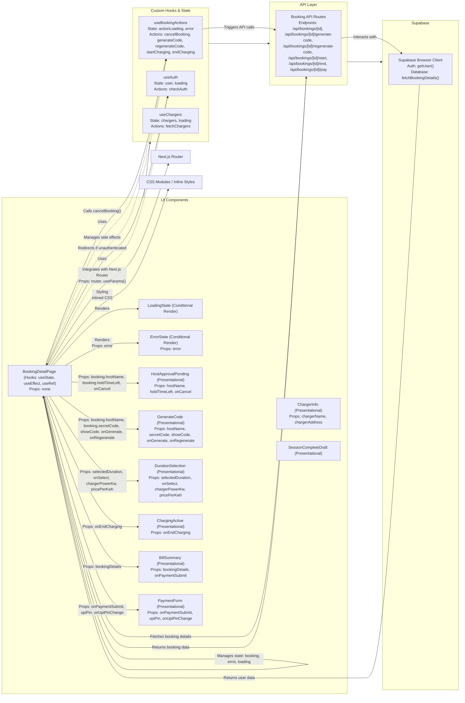

# Booking Detail Page: Component Architecture and Data Flow

## Key Architecture Insights

### 1. **Component Breakdown**
- **Container Component**: `BookingDetailPage` acts as the **container**, managing state, side effects, and API interactions.
- **Presentational Components**: All conditional renders (`HostApprovalPending`, `GenerateCode`, etc.) are **dumb components** receiving props and emitting events.

### 2. **State Management**
- **Local State**: Managed via `useState` and `useEffect` within `BookingDetailPage`.
- **Custom Hooks**: `useBookingActions` encapsulates action logic (cancel, start/stop charging), while `useAuth` manages authentication state.

### 3. **Data Flow**
- **API Layer**: Thin fetch wrappers (`/api/bookings/[id]/*`) abstract Supabase interactions.
- **Supabase**: Handles auth (`getUser`) and database (`fetchBookingDetails`) operations.

### 4. **Side Effects**
- **Timers**: `holdTimerRef` (countdown) and `showCodeTimer` (auto-hide OTP) are managed via `useEffect` and `useRef`.
- **Cleanup**: Timers are cleared in `useEffect` return functions to prevent memory leaks.

### 5. **Error Handling**
- **Consistent Pattern**: All API calls set `error` state on failure, displayed uniformly via `ErrorState`.
- **Loading States**: `loading` and `actionLoading` flags prevent race conditions and provide user feedback.

### 6. **Props Passing**
- **Explicit Contracts**: Presentational components receive **only** the props they need (e.g., `GenerateCode` gets `secretCode`, not the entire `booking`).
- **Event Callbacks**: Child components emit events via callbacks (`onGenerate`, `onCancel`).

### 7. **Conditional Rendering**
- **Booking Status**: UI dynamically renders based on `booking.status` (e.g., `pending_host_accept`, `charging`).
- **Payment State**: Handles both pre-payment (`PaymentForm`) and post-payment (`paymentSuccess`) states.

### 8. **Performance Optimizations**
- **Memoization**: Not explicitly shown, but candidate for optimization (e.g., `useMemo` for `chargerPowerKw` calculations).
- **Timer Efficiency**: `holdTimerRef` updates only when `booking.status` or `booking.holdExpiresAt` changes.

### 9. **Integration Points**
- **Next.js Router**: Used for navigation (`router.push("/login")`).
- **Supabase Client**: Singleton via `getSupabaseBrowserClient()`.
- **Custom Hooks**: Modular logic encapsulation (`useBookingActions`, `useAuth`).

### 10. **Anti-Patterns & Improvements**
- **Type Safety**: `booking: any` should be replaced with a `Booking` type.
- **Over-fetching**: `fetchBookingDetails` fetches the entire booking; consider GraphQL or finer endpoints.
- **Error Handling**: Network errors (`catch` blocks) could log to a service for observability.
- **OTP Timer**: Hardcoded 3.5s expiry; could be configurable via `booking.codeExpiry`.

## Industry Best Practices Applied

1. **Container-Presentational Pattern**: Clear separation of concerns between stateful and stateless components.

2. **Compound Components**: Groups of related components (`DurationSelection` options) managed by a single parent.

3. **Custom Hooks**: Reusable logic (`useBookingActions`, `useAuth`) avoids prop drilling.

4. **Controlled Inputs**: `PaymentForm` uses controlled components (`upiPin`).

5. **Optimistic UI**: Actions like `handleGenerateCode` optimistically update the UI before API confirmation.

6. **Clean Architecture**: API layer abstracts Supabase, enabling easier backend swaps.

## Elite Textbook Recommendations

1. **TypeScript**: Replace `any` with strict types for `booking`, `charger`, and API responses.

2. **React Query/SWR**: Replace manual `fetchBookingDetails` with a library for caching, retries, and deduplication.

3. **State Machines**: Model `booking.status` transitions with XState or similar for explicit state management.

4. **Storybook**: Isolate presentational components (`ChargerInfo`, `GenerateCode`) for visual testing.

5. **Testing**:
   - **Unit Tests**: Custom hooks (`useAuth`, `useBookingActions`) via `@testing-library/react-hooks`.
   - **Integration Tests**: API calls (`fetchBookingDetails`) mocked with MSW.
   - **E2E Tests**: Critical flows (cancel booking, payment) via Playwright.

6. **Performance**:
   - Memoize derived values (e.g., `chargerPowerKw` calculations).
   - Virtualize duration options if list grows.

7. **Security**:
   - Mask `upiPin` input; avoid logging it.
   - Validate OTP expiry server-side.

8. **Accessibility**:
   - Add `aria-live` for dynamic content (e.g., OTP display).
   - Ensure contrast ratios meet WCAG standards.

---