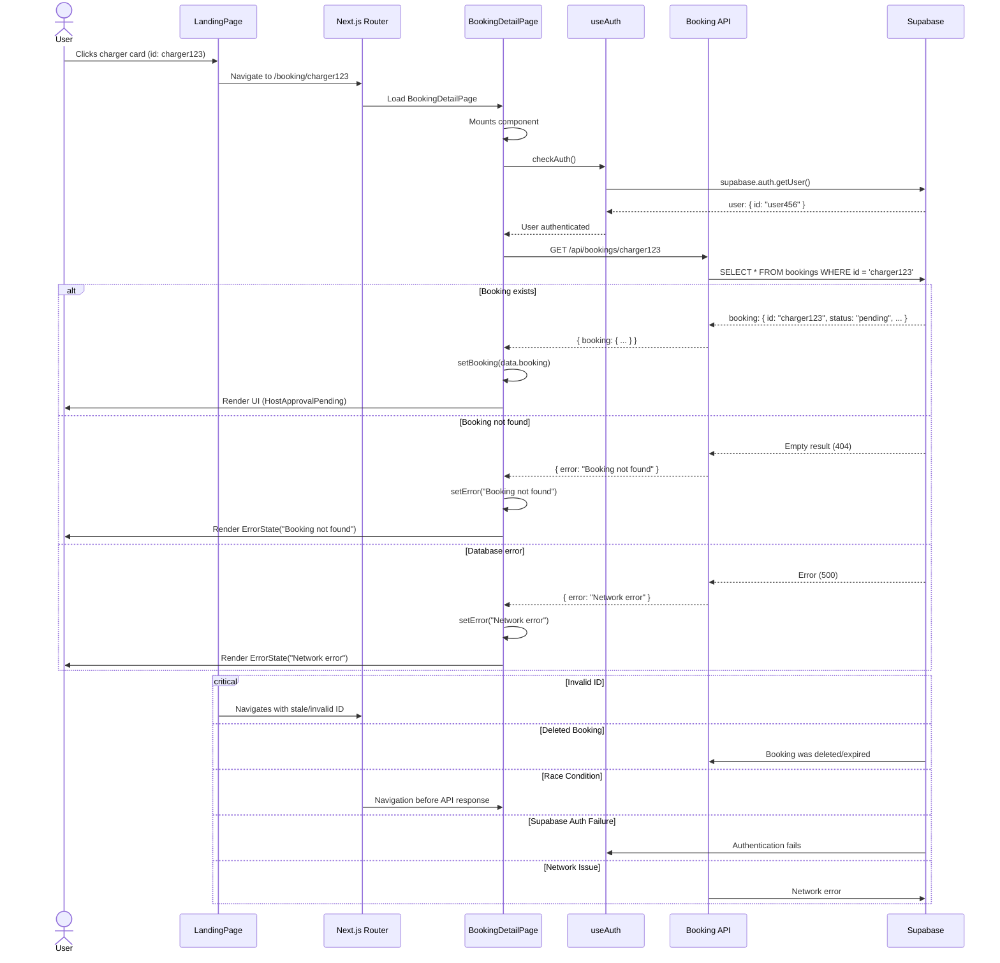

```mermaid
sequenceDiagram
    %% Actors
    actor User as User
    participant LP as LandingPage
    participant NR as Next.js Router
    participant BDP as BookingDetailPage
    participant Auth as useAuth
    participant API as Booking API
    participant SB as Supabase

    %% User Interaction
    User->>LP: Clicks charger card (id: charger123)
    LP->>NR: Navigate to /booking/charger123
    NR->>BDP: Load BookingDetailPage

    %% Component Lifecycle
    BDP->>BDP: Mounts component
    BDP->>Auth: checkAuth()
    Auth->>SB: supabase.auth.getUser()
    SB-->>Auth: user: { id: "user456" }
    Auth-->>BDP: User authenticated

    %% Data Fetching
    BDP->>API: GET /api/bookings/charger123
    API->>SB: SELECT * FROM bookings WHERE id = 'charger123'
    alt Booking exists
        SB-->>API: booking: { id: "charger123", status: "pending", ... }
        API-->>BDP: { booking: { ... } }
        BDP->>BDP: setBooking(data.booking)
        BDP->>User: Render UI (HostApprovalPending)
    else Booking not found
        SB-->>API: Empty result (404)
        API-->>BDP: { error: "Booking not found" }
        BDP->>BDP: setError("Booking not found")
        BDP->>User: Render ErrorState("Booking not found")
    else Database error
        SB-->>API: Error (500)
        API-->>BDP: { error: "Network error" }
        BDP->>BDP: setError("Network error")
        BDP->>User: Render ErrorState("Network error")
    end

    %% Root Cause Analysis
    critical Invalid ID
        LP->>NR: Navigates with stale/invalid ID
    option Deleted Booking
        SB->>API: Booking was deleted/expired
    option Race Condition
        NR->>BDP: Navigation before API response
    option Supabase Auth Failure
        SB->>Auth: Authentication fails
    option Network Issue
        API->>SB: Network error
    end
```