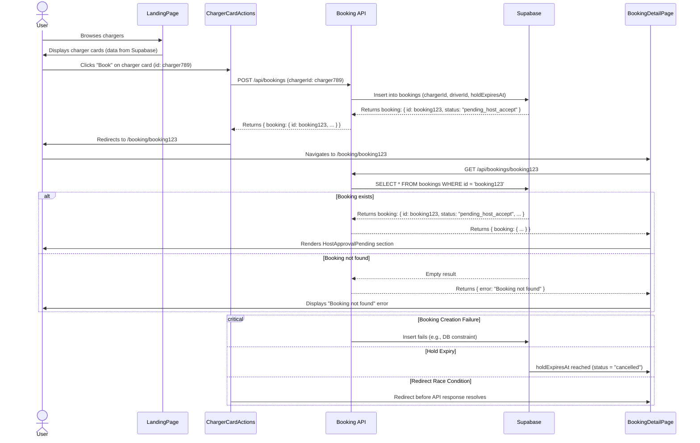

```mermaid
sequenceDiagram
    %% Booking Creation Flow Trace %%
    %% Actors
    actor User as User
    participant LP as LandingPage
    participant CCA as ChargerCardActions
    participant API as Booking API
    participant SB as Supabase
    participant BDP as BookingDetailPage

    %% User Initiates Booking
    User->>LP: Browses chargers
    LP->>User: Displays charger cards (data from Supabase)
    User->>CCA: Clicks "Book" on charger card (id: charger789)

    %% Booking Creation Flow
    CCA->>API: POST /api/bookings (chargerId: charger789)
    API->>SB: Insert into bookings (chargerId, driverId, holdExpiresAt)
    SB-->>API: Returns booking: { id: booking123, status: "pending_host_accept" }
    API-->>CCA: Returns { booking: { id: booking123, ... } }
    CCA->>User: Redirects to /booking/booking123

    %% Booking Detail Page Loads
    User->>BDP: Navigates to /booking/booking123
    BDP->>API: GET /api/bookings/booking123
    API->>SB: SELECT * FROM bookings WHERE id = 'booking123'
    
    alt Booking exists
        SB-->>API: Returns booking: { id: booking123, status: "pending_host_accept", ... }
        API-->>BDP: Returns { booking: { ... } }
        BDP->>User: Renders HostApprovalPending section
    else Booking not found
        SB-->>API: Empty result
        API-->>BDP: Returns { error: "Booking not found" }
        BDP->>User: Displays "Booking not found" error
    end

    %% Critical Failure Points
    critical Booking Creation Failure
        API->>SB: Insert fails (e.g., DB constraint)
    option Hold Expiry
        SB->>BDP: holdExpiresAt reached (status = "cancelled")
    option Redirect Race Condition
        CCA->>BDP: Redirect before API response resolves
    end

```