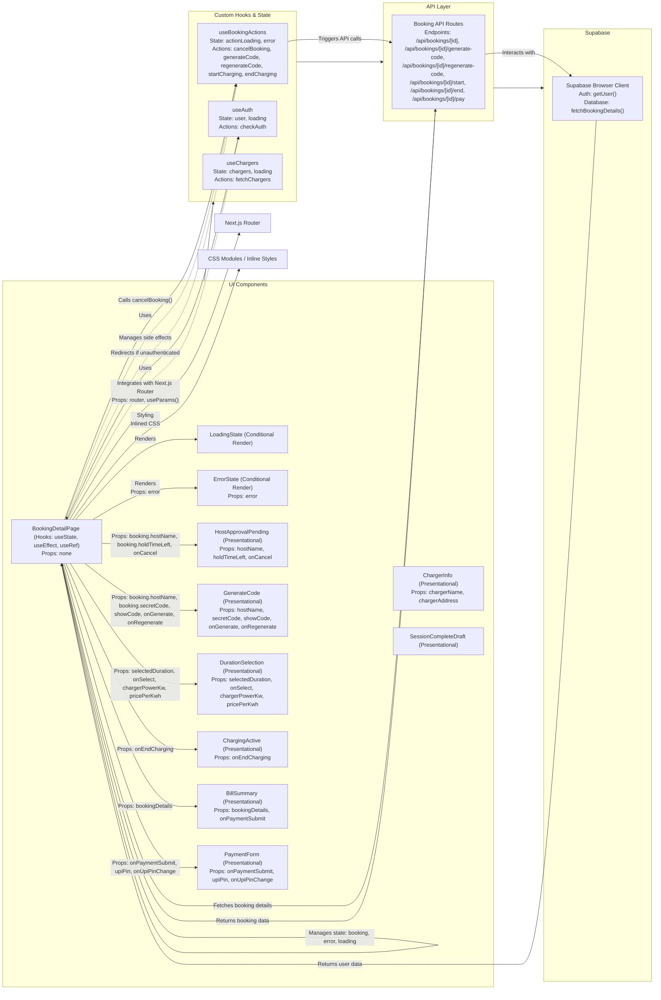

```mermaid
graph LR
    %% Layers
    subgraph UI["UI Components"]
        direction TB
        BookingDetailPage["BookingDetailPage (Hooks: useState, useEffect, useRef)<br/>Props: none"]
        LoadingState["LoadingState (Conditional Render)"]
        ErrorState["ErrorState (Conditional Render)<br/>Props: error"]
        ChargerInfo["ChargerInfo (Presentational)<br/>Props: chargerName, chargerAddress"]
        HostApprovalPending["HostApprovalPending (Presentational)<br/>Props: hostName, holdTimeLeft, onCancel"]
        GenerateCode["GenerateCode (Presentational)<br/>Props: hostName, secretCode, showCode, onGenerate, onRegenerate"]
        DurationSelection["DurationSelection (Presentational)<br/>Props: selectedDuration, onSelect, chargerPowerKw, pricePerKwh"]
        ChargingActive["ChargingActive (Presentational)<br/>Props: onEndCharging"]
        SessionCompleteDraft["SessionCompleteDraft (Presentational)"]
        BillSummary["BillSummary (Presentational)<br/>Props: bookingDetails, onPaymentSubmit"]
        PaymentForm["PaymentForm (Presentational)<br/>Props: onPaymentSubmit, upiPin, onUpiPinChange"]
    end

    subgraph Hooks["Custom Hooks & State"]
        direction TB
        useBookingActions["useBookingActions<br/>State: actionLoading, error<br/>Actions: cancelBooking, generateCode, regenerateCode, startCharging, endCharging"]
        useAuth["useAuth<br/>State: user, loading<br/>Actions: checkAuth"]
        useChargers["useChargers<br/>State: chargers, loading<br/>Actions: fetchChargers"]
    end

    subgraph API["API Layer"]
        direction TB
        BookingAPI["Booking API Routes<br/>Endpoints: /api/bookings/[id], /api/bookings/[id]/generate-code, /api/bookings/[id]/regenerate-code, /api/bookings/[id]/start, /api/bookings/[id]/end, /api/bookings/[id]/pay"]
    end

    subgraph Supabase["Supabase"]
        direction TB
        SupabaseClient["Supabase Browser Client<br/>Auth: getUser()<br/>Database: fetchBookingDetails()"]
    end

    %% Data Flow
    BookingDetailPage -->|"Fetches booking details"| BookingAPI
    BookingAPI -->|"Returns booking data"| BookingDetailPage
    BookingDetailPage -->|"Manages state: booking, error, loading"| BookingDetailPage
    BookingDetailPage -->|"Props: booking.hostName, booking.holdTimeLeft, onCancel"| HostApprovalPending
    BookingDetailPage -->|"Props: booking.hostName, booking.secretCode, showCode, onGenerate, onRegenerate"| GenerateCode
    BookingDetailPage -->|"Props: selectedDuration, onSelect, chargerPowerKw, pricePerKwh"| DurationSelection
    BookingDetailPage -->|"Props: onEndCharging"| ChargingActive
    BookingDetailPage -->|"Props: bookingDetails"| BillSummary
    BookingDetailPage -->|"Props: onPaymentSubmit, upiPin, onUpiPinChange"| PaymentForm
    BookingDetailPage -->|"Calls cancelBooking()"| useBookingActions
    useBookingActions -->|"Triggers API calls"| BookingAPI
    BookingAPI -->|"Interacts with"| SupabaseClient
    SupabaseClient -->|"Returns user data"| BookingDetailPage
    BookingDetailPage -->|"Redirects if unauthenticated"| useAuth

    %% Hooks & Actions
    BookingDetailPage -.->|"Uses"| useAuth
    BookingDetailPage -.->|"Uses"| useBookingActions
    useBookingActions -.->|"Manages side effects"| BookingDetailPage

    %% Error & Loading
    BookingDetailPage -->|"Renders"| LoadingState
    BookingDetailPage -->|"Renders<br/>Props: error"| ErrorState

    %% Integration Points
    BookingDetailPage -->|"Integrates with Next.js Router<br/>Props: router, useParams()"| NextRouter["Next.js Router"]
    BookingDetailPage -->|"Styling<br/>Inlined CSS"| Styling["CSS Modules / Inline Styles"]

    %% Subgraphs Alignment
    UI --> Hooks --> API --> Supabase

```