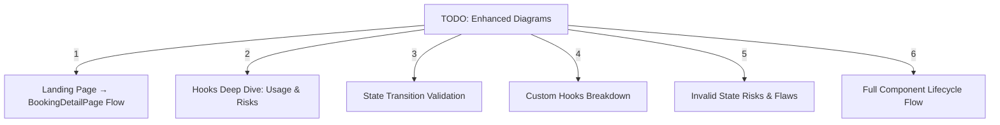
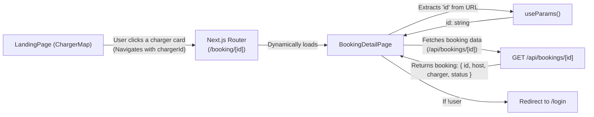
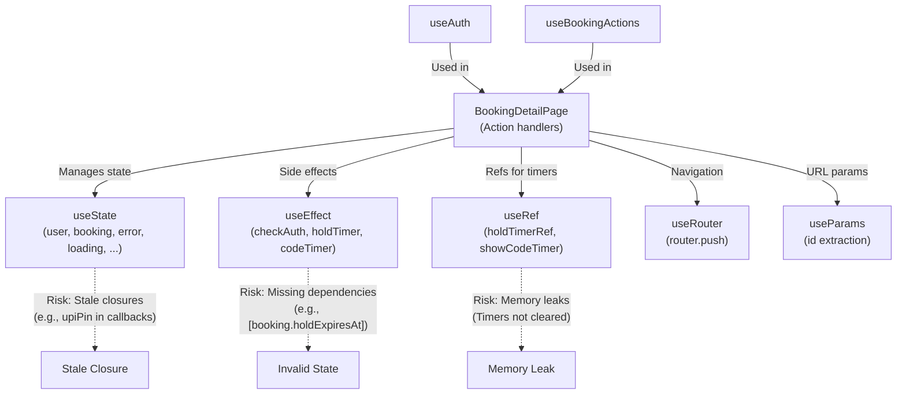
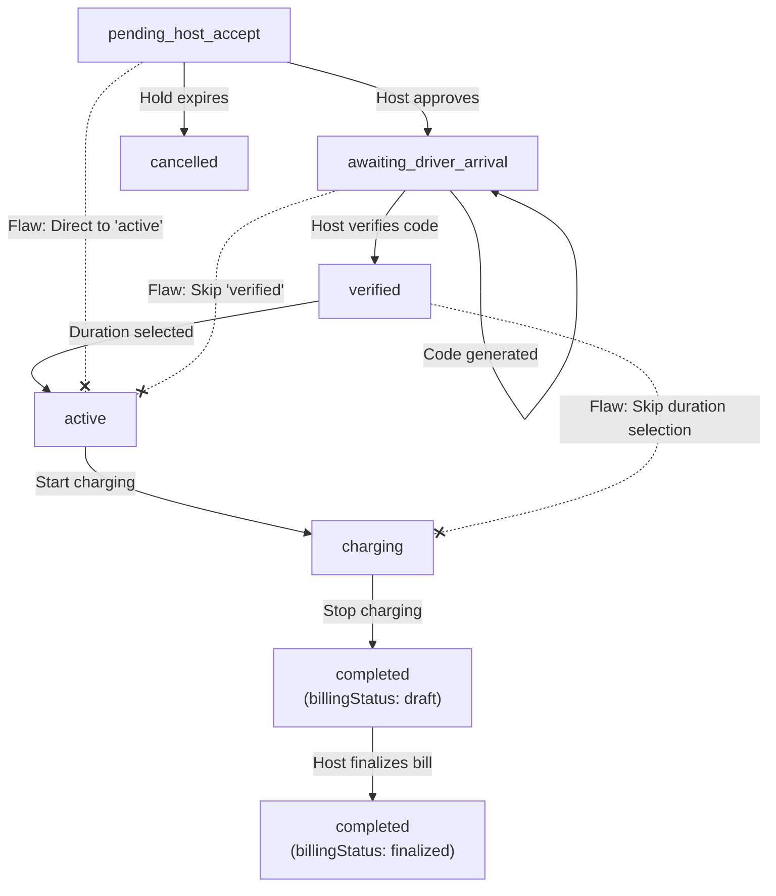
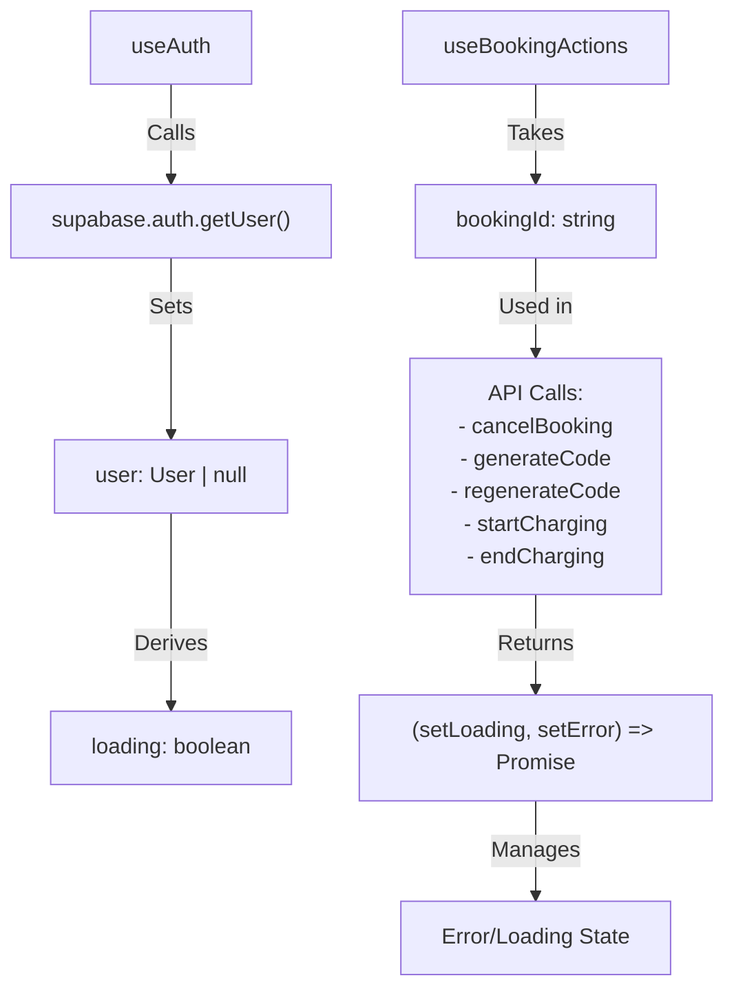
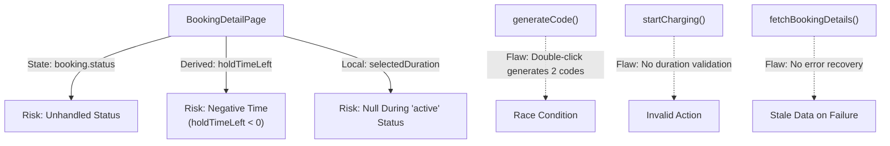
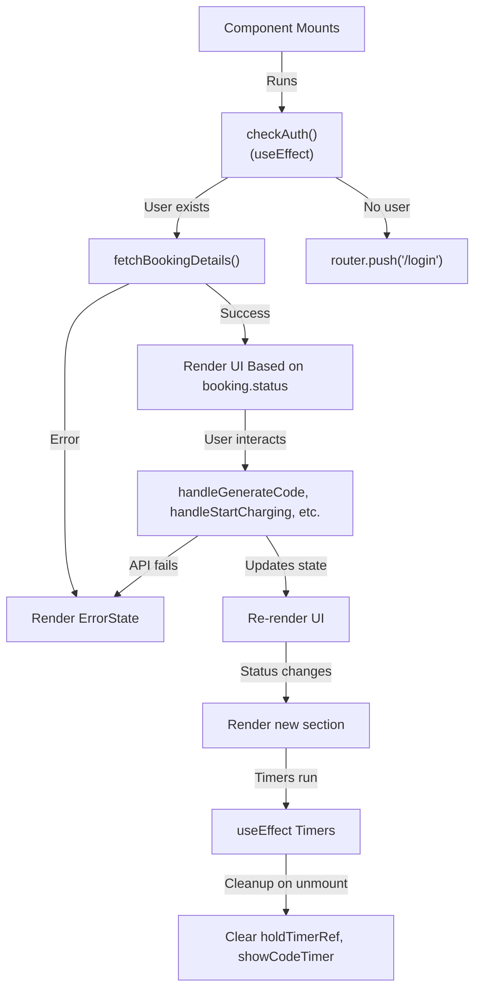

---

### 1. **Landing Page → BookingDetailPage Flow**

---

### 2. **Hooks Deep Dive: Usage & Risks**

---

### 3. **State Transition Validation**

---

### 4. **Custom Hooks Breakdown**

---

### 5. **Invalid State Risks & Flaws**

---

### 6. **Full Component Lifecycle Flow**
