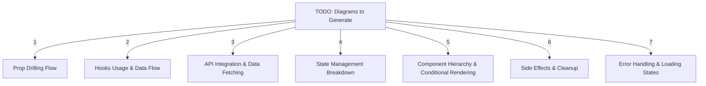
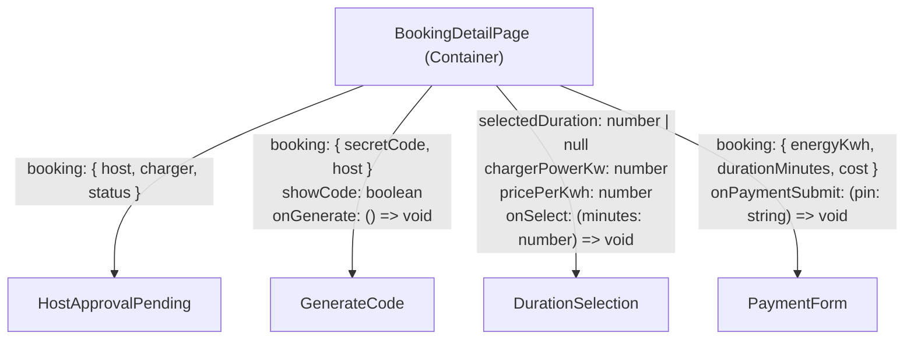
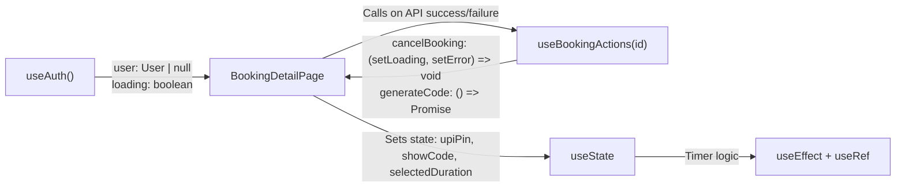
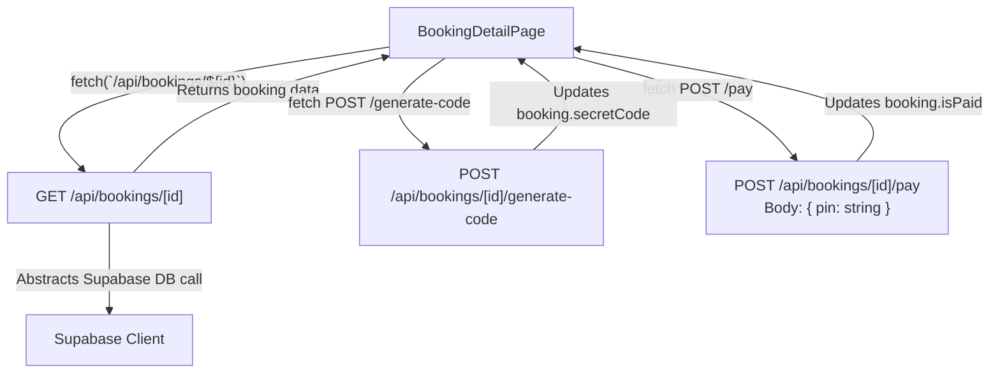
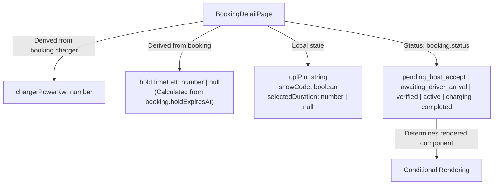
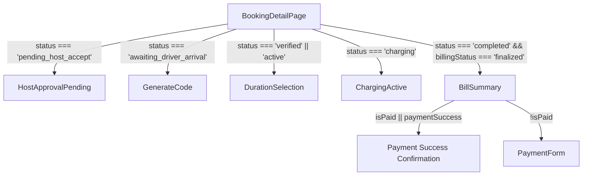
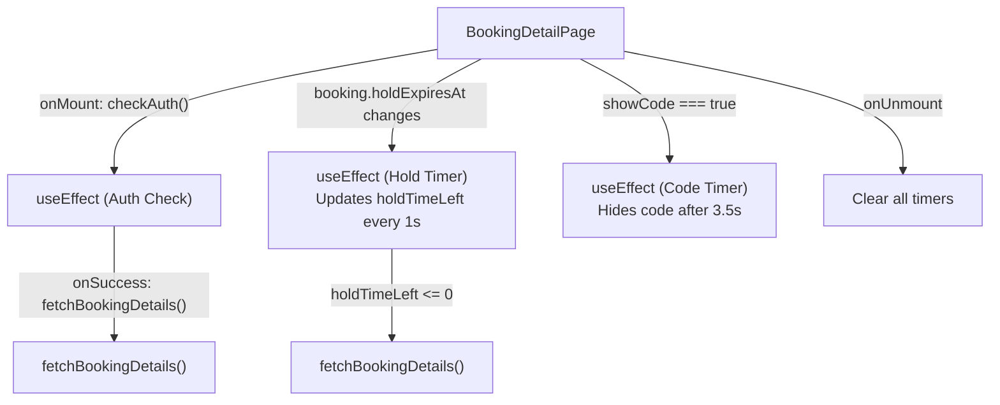
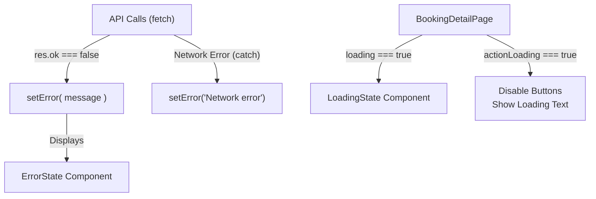

---

### 1. **Prop Drilling Flow**

---

### 2. **Hooks Usage & Data Flow**

---

### 3. **API Integration & Data Fetching**

---

### 4. **State Management Breakdown**

---

### 5. **Component Hierarchy & Conditional Rendering**

---

### 6. **Side Effects & Cleanup**

---

### 7. **Error Handling & Loading States**
